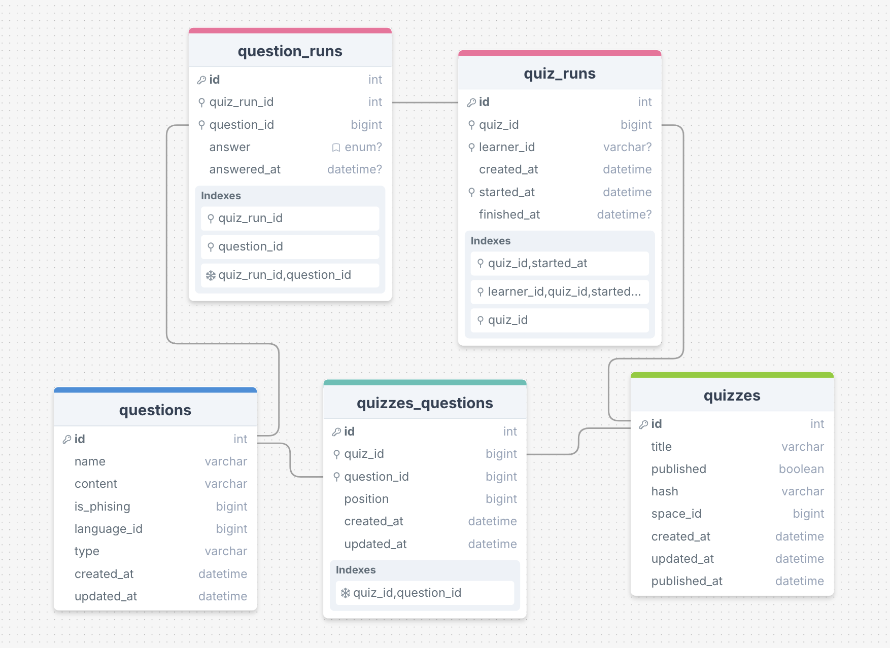
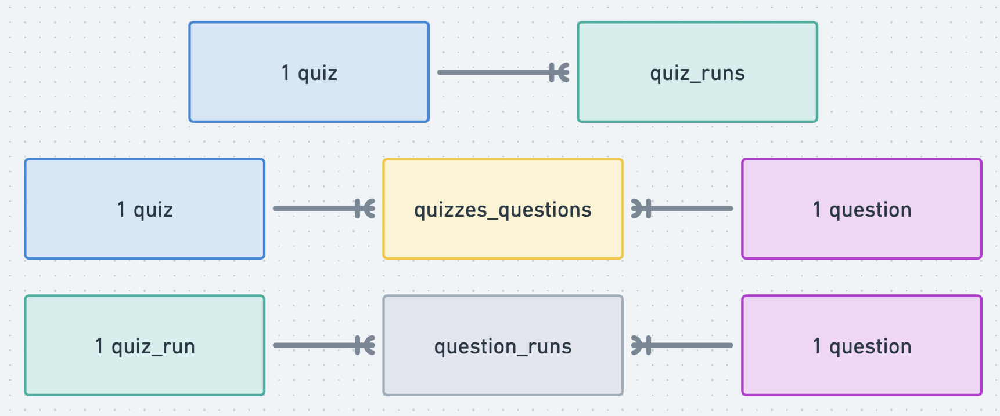

<p align="center">
  <a href="http://nestjs.com/" target="blank"></a>
</p>

[circleci-image]: https://img.shields.io/circleci/build/github/nestjs/nest/master?token=abc123def456
[circleci-url]: https://circleci.com/gh/nestjs/nest

  <p align="center">A progressive <a href="http://nodejs.org" target="_blank">Node.js</a> framework for building efficient and scalable server-side applications.</p>
    <p align="center">
<a href="https://www.npmjs.com/~nestjscore" target="_blank"></a>
<a href="https://www.npmjs.com/~nestjscore" target="_blank"></a>
<a href="https://www.npmjs.com/~nestjscore" target="_blank"></a>
<a href="https://circleci.com/gh/nestjs/nest" target="_blank"></a>
<a href="https://coveralls.io/github/nestjs/nest?branch=master" target="_blank"></a>
<a href="https://discord.gg/G7Qnnhy" target="_blank"></a>
<a href="https://opencollective.com/nest#backer" target="_blank"></a>
<a href="https://opencollective.com/nest#sponsor" target="_blank"></a>
  <a href="https://paypal.me/kamilmysliwiec" target="_blank"></a>
    <a href="https://opencollective.com/nest#sponsor"  target="_blank"></a>
  <a href="https://twitter.com/nestframework" target="_blank"></a>
</p>
  <!--[](https://opencollective.com/nest#backer)
  [](https://opencollective.com/nest#sponsor)-->

## Production deployment with Docker Compose

* Copy the `.env.example` file into `.env`

  ```sh
  cp .env.example .env
  ```

* Generate passwords for different services and add them to your `.env`.
  You can use `openssl rand -hex 32` to generate them securely.

* Unless you're setting up a custom S3 bucket for the images service,
  skip the `IMAGE_` options for now.

* Run the compose file:

  ```sh
  docker compose up -d
  ```

* Once the service is running, create the actual bucket and access key:

  ```sh
  id=`docker exec shira-images-1 /garage node id -q`
  # Change 1G to your actual storage capacity
  docker exec shira-images-1 /garage layout assign -z images -c 1G $id
  docker exec shira-images-1 /garage layout apply --version 1
  # Keep the output of this command somewhere safe
  docker exec shira-images-1 /garage key create shira
  docker exec shira-images-1 /garage bucket create shira
  docker exec shira-images-1 /garage bucket allow --read --write --owner --key shira shira
  ```

* Use the "Key ID" and "Secret key" fields from the key creation step as
  `IMAGE_ACCESS_KEY` and `IMAGE_SECRET_KEY` env vars, respectively:

  ```sh
  IMAGE_ACCESS_KEY=GKa85289d7ee87ccd281789601
  IMAGE_SECRET_KEY=d345381e9b6f0e835e900592fae82ebba83cbf132553abd5fbb1f6302510ec56
  ```

* Restart the service:

  ```sh
  docker compose restart
  ```

## Required clients to install

- nestjs cli
- typeorm cli

## Required steps for using docker containers

- docker network create shira-network

## Run migration

this needs to be inside docker container

- to run migrations `npm run typeorm -- migration:run -d ./src/utils/datasources/mysql.datasource.ts`
- to create migrations `npm run typeorm migration:create ./src/migrations/your_migration`

## Description

[Nest](https://github.com/nestjs/nest) framework TypeScript starter repository.

## Diagrams

### Database ERD



### Relationships overview



## Installation

```bash
$ npm install
```

## Running the app

```bash
# development
$ npm run start

# watch mode
$ npm run start:dev

# production mode
$ npm run start:prod
```

## Test

```bash
# unit tests
$ npm run test

# e2e tests
$ npm run test:e2e

# test coverage
$ npm run test:cov
```

## Support

Nest is an MIT-licensed open source project. It can grow thanks to the sponsors and support by the amazing backers. If you'd like to join them, please [read more here](https://docs.nestjs.com/support).

## Stay in touch

- Author - [Kamil Myśliwiec](https://kamilmysliwiec.com)
- Website - [https://nestjs.com](https://nestjs.com/)
- Twitter - [@nestframework](https://twitter.com/nestframework)

## License

Nest is [MIT licensed](LICENSE).
